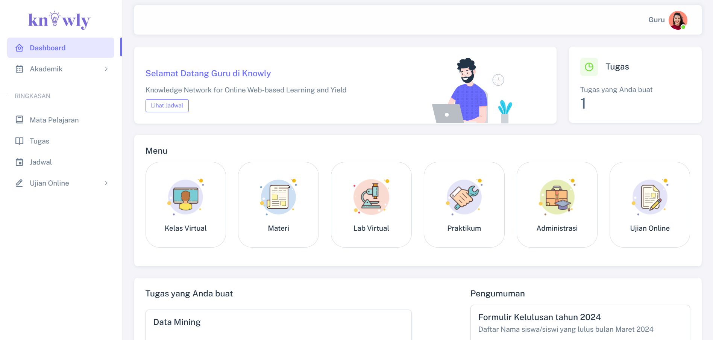

## **Knowly - Knowledge Network for Online Web-based Learning and Yield** 

Knowly adalah Learning Management System (LMS) yang dirancang untuk mendukung proses pembelajaran online dengan lebih efektif dan hasil yang terukur. Sebagai solusi terintegrasi, Knowly memungkinkan institusi pendidikan, organisasi, dan individu untuk mengelola, mengakses, dan mengoptimalkan pengalaman pembelajaran berbasis web.

<hr />  

**Jenis Akun Pengguna:**  
Knowly mendukung tiga jenis akun pengguna, yaitu:  
1. **Administrator (Super Admin & Admin)**  
2. **Guru**  
3. **Siswa**  

---
### **Clone Repository**  
1. Clone repository dengan cara copy link repository dan jalankan di cmd  
   ```bash  
   git clone https://github.com/calvinrdtya/Knowly.git
   ```  
2. Setelah Knowly berhasil di clone jalankan Instalasi

### **Instalasi**  
1. Install dependensi:  
   ```bash  
   composer install  
   ```  
2. Copy .env.example ke .env dengan menjalankan perintah dibawah
    ```bash
    cp .env.example .env
    ```
3. Atur kredensial database dan pengaturan aplikasi di file .env
    ```bash
    php artisan key:generate
    ```
4. Migrasi database
   ```bash  
   php artisan migrate
   ```  
5. Isi data awal database (seeding)
   ```bash  
   php artisan db:seed  
   ```  
6. Jalankan 
   ```bash  
   php artisan serve 
   ```  

---

### **Kredensial Login**  
Setelah seeding database, gunakan detail login berikut:  

| Jenis Akun    | Username  | Email                | Password |
|---------------|-----------|----------------------|----------|
| Super Admin   | Knowly        | superadmin@gmail.com            | knowly       |
| Guru         | Guru     | guru@gmail.com      | knowly       |
| Siswa          | Siswa   | siswa@gmail.com  | knowly       |

---


### **Fungsi Akun**  

**Super Admin**  
- Hanya Super Admin yang dapat menghapus data apa pun.  
- Membuat semua jenis akun pengguna.  
- Membuat Jadwal

**Guru**  
- Mengelola kelas sendiri.  
- Mengelola catatan ujian untuk mata pelajaran yang diajarkan.  
- Mengelola profil sendiri.  
- Mengunggah tugas pembelajaran. 
- Membuat Kuis

**Siswa**  
- Melihat profil guru.  
- Melihat mata pelajaran kelas sendiri.  
- Melihat papan pengumuman dan acara sekolah di kalender.  
- Mengelola profil sendiri.  
- Mengakses Kuis

---

## screenshot ##

**Home**


**Team**


**Login**


--- 
## ROLE SISWA ##

**Dashboard**


**Kalender Akademik**


**Mata Pelajaran**


**Halaman Absen**


**Jadwal harian**


**Tugas**


**Pengumpulan Tugas**


**Kuis**


--- 
## ROLE GURU ##

**DASHBOARD**


**KALENDER AKADEMIK**


**ABSENSI MATA PELAJARAN**


**TUGAS**


**BUAT TUGAS**


**DETAIL TUGAS**


**KUIS**


**BUAT KUIS**

